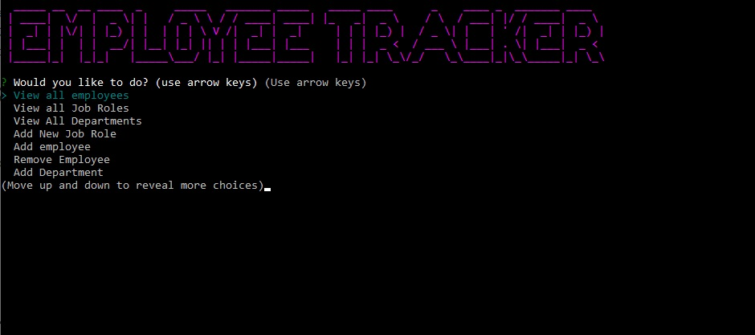

# Employee Tracker Application

The following is an overview documentation for the employee tracker program.  This Node & SQL - based applicaiton allows your business to add/remove and track employees, job roles, even entire departments.  

# Setup Instructions
Before you can you use this application, you must first setup and connect to a MySQL database.  If you already have an SQL server setup, please use the syntax provided in the file seed.sql to setup your database and populate it with your company's data.

# Required Node Dependencies
Once you've successfully completed the setup of your mySQL database, you will need to download and install the following required node dependencies, in order for this application to work:

* Mysql
* Inquirer
* Figlet
* Chalk
* Clear

# Operation
Once you've completed all the setup instructions, and downloaded all required Node dependencies, you can run this application by typing the following command:

npm start

